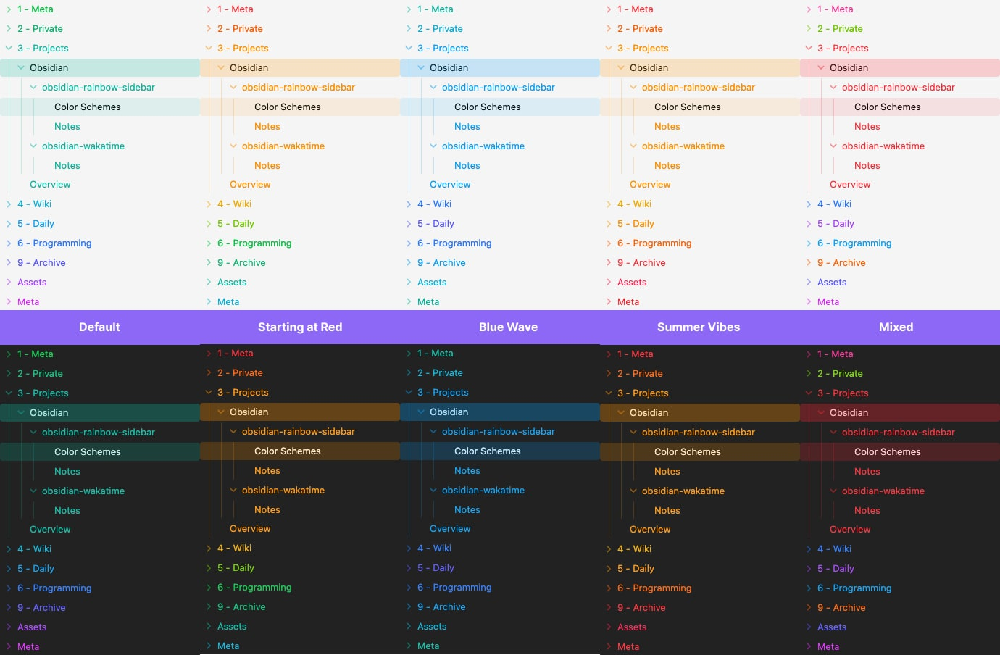

<h1 align="center">Rainbow-Colored Sidebar Plugin</h1>

  <picture>
    
  </picture>

This [Obsidian](https://obsidian.md) plugin automatically colors your sidebar based on a color scheme you select. No configuration needed for single folders. No CSS tweaking needed. No folder prefixes needed.

I built this plugin because I wasn't satisfied with the options for colored sidebars that are currently available. There is no limit in the number of folders in your sidebar, as the color theme repeats infinitely. 

> [!IMPORTANT]
> This plugin automatically colors your sidebar based on the folder list sorted from A-Z. The ordering of folders in your file manager cannot be taken into account, so it's possible that some colors might end up mixed.

## Features

- 9 Color Themes compatible with both the dark and light mode of Obsidian.
  - 5 themes for a default rainbow color scheme starting at various colors. The default starts at green.
  - 2 special themes: Blue Wave which only uses blue colors, and Summer Vibes which uses a palette from red to yellow.
  - 1 mixed scheme for a sprinkle of randomness in your folder structure.
  - 1 Accessibility theme with colors that are easier to distinguish.
  - More coming soon!
- Automatic coloring of sub-folders and files, with an indicator for active files.
- Additional option to toggle an accessibility mode which increases the color contrast.
- Option to restart the coloring for subfolders so larger structures may get their own styling.

## Installation

### From Community Plugins
1. Open Obsidian or the [Plugin Marketplace](https://obsidian.md/plugins?id=rainbow-colored-sidebar)
2. Go to `Settings` > `Community plugins`.
3. Click on `Browse` and search for `Rainbow-Colored Sidebar`.
4. Click `Install` and then `Enable`.

### From Release Download
1. Download the latest release from the [GitHub releases page](https://github.com/kovah/obsidian-rainbow-colored-sidebar/releases).
2. Extract the downloaded zip file.
3. Copy the extracted folder to your Obsidian plugins directory: `/.obsidian/plugins/`.
4. Open Obsidian and go to `Settings` > `Community plugins`. Click the reload icon.
5. Find `Rainbow-Colored Sidebar` and click `Enable`.

## Configuration
1. Open Obsidian.
2. Go to `Settings` > `Rainbow-Colored Sidebar`.

### Base Settings
- **Select the Color Scheme**: Choose your theme. Done. Nothing else needed.

### Accessibility Settings
- **Increase Contrast**: Increases the color contrast if enabled for better readability.

### Enable Independent Color Scheme for Specific Folders
This restarts the color scheme for selected sub folders to distinguish them from top level folders

- **Select folders**: Select a folder from your Vault to restart the color scheme for that folder. 

---

This project is inspired by the [Colored Sidebar CSS Snipped](https://github.com/CyanVoxel/Obsidian-Colored-Sidebar).

---

❤️ Support my work via [Patreon](https://www.patreon.com/Kovah), [Github Sponsors](https://github.com/sponsors/Kovah) or [Liberapay](https://liberapay.com/kovah/).
